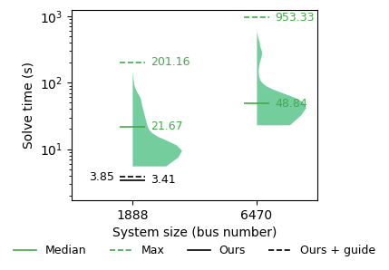

# supplementary-material

  

  <b>Figure 1.</b>
  AC-IPOPT solve time distributions across power systems of increasing size.
  Each half-violin shows per-instance runtimes, capturing central tendency and tail behavior.
  Red markers indicate deterministic inference time of our method.

  
     
    (a) Active Power
  
  &nbsp;&nbsp;
  
     
    (b) Reactive Power
  

  <b>Figure 1.</b>
    Ridgeline histograms of normalized generator outputs across 128 samples generated by GridDiffuser under a fixed operating condition.
    Many generators exhibit separated modes, suggesting that the solution distribution is not tightly concentrated.
    Such behavior is less apparent in smaller systems, possibly due to reduced degrees of freedom and simpler constraint structure.

---

